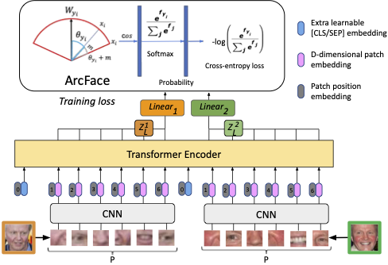
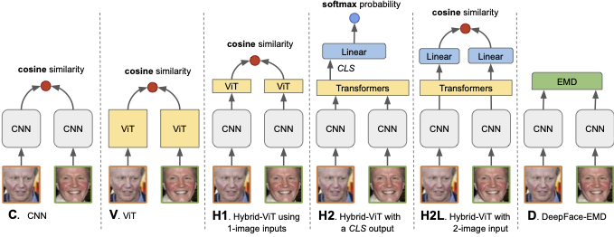

## Fast and Interpretable Face Identification for Out-Of-Distribution Data Using Vision Transformers

`Official Implementation` for the paper [Fast and Interpretable Face Identification for Out-Of-Distribution Data Using Vision Transformers](https://arxiv.org/abs/2311.02803) (WACV 2023) by Hai Phan, Cindy Le, Vu Le, Yihui He, and Anh Nguyen.

 



**If you use this software, please consider citing:**

    @article{hai2023facevit,
      title={Fast and Interpretable Face Identification for Out-Of-Distribution Data Using Vision Transformers},
      author={Hai Phan, Cindy Le, Vu Le, Yihui He, Anh Nguyen},
      journal={arXiv preprint arXiv:2311.02803},
      year={2023}
    }

## 1. Requirements
```
Python >= 3.5
Pytorch > 1.0
Opencv >= 3.4.4
pip install tqmd
pip install mxnet
pip install wandb
```

## 2. Download datasets and pretrained models

1. Download LFW, _out-of-distribution_ (OOD) LFW test sets: [Google Drive](https://drive.google.com/drive/folders/1hoyO7IWaIx2Km-pe4-Sn2D_uTFNLC7Ph?usp=sharing)
2. Download CASIA for training: [Here](https://github.com/yule-li/CosFace/blob/master/README.md)

3. Download pretrained models:
   - [Backbones](https://drive.google.com/drive/folders/1hr77R4rRFFsO8AnSD0kQ5Do7jGf0bc4P?usp=sharing)
   - [ViT-Face](https://drive.google.com/drive/folders/1ZYHbe0Sc50HQEEXthX3wus-Vg8SGiK1l?usp=sharing)
   - [ViT-P8S8](https://drive.google.com/drive/folders/1LEshPNCEP0IGbYGXzkxNP2Tp2SUAKGzD?usp=sharing)

4. Download arranged pairs: [Google Drive](https://drive.google.com/drive/folders/1NRuKRQAvHECFvmZW-sDBQSy0t0LsaLCI?usp=sharing)
   
5. Create the following folders:

```
mkdir results
mkdir pretrained
```
Then put pretrained models to `results` folder and `pretrained` for testing and training, respectively.

## 3. How to run

1. Training:
   Revise directory in `train.py` and `config.py` with your own directory. Then, run
   ```
   python train.py
   ```
   
2. Testing:
   Revise directory in `test.py` with your own directory. Then, run
   ```
   python test.py
   ```

## 4. License
MIT

## 5. References
1. W. Zhao, Y. Rao, Z. Wang, J. Lu, Zhou. Towards interpretable deep metric learning with structural matching, ICCV 2021 [DIML](https://github.com/wl-zhao/DIML)
2. J.  Deng,   J. Guo,   X. Niannan,   and   StefanosZafeiriou.   Arcface:  Additive angular margin loss for deepface recognition, CVPR 2019 [Arcface Pytorch](https://github.com/ronghuaiyang/arcface-pytorch)
3. H. Phan, A. Nguyen. DeepFace-EMD: Re-ranking Using Patch-wise Earth Mover’s Distance Improves Out-Of-Distribution Face Identification, CVPR 2022 [DeepFace-EMD](https://github.com/anguyen8/deepface-emd)
4. F. Schroff,  D. Kalenichenko, J. Philbin. Facenet: A unified embedding for face recognition and clustering. CVPR 2015 [FaceNet Pytorch](https://github.com/timesler/facenet-pytorch)
5. L. Weiyang, W. Yandong, Y. Zhiding, L. Ming, R. Bhiksha, S. Le. SphereFace: Deep Hypersphere Embedding for Face Recognition, CVPR 2017 [sphereface](https://github.com/wy1iu/sphereface), [sphereface pytorch](https://github.com/clcarwin/sphereface_pytorch)
6. Chi Zhang, Yujun Cai, Guosheng Lin, Chunhua Shen. Deepemd: Differentiable earth mover’s distance for few-shotlearning, CVPR 2020 [paper](https://arxiv.org/pdf/2003.06777.pdf)
